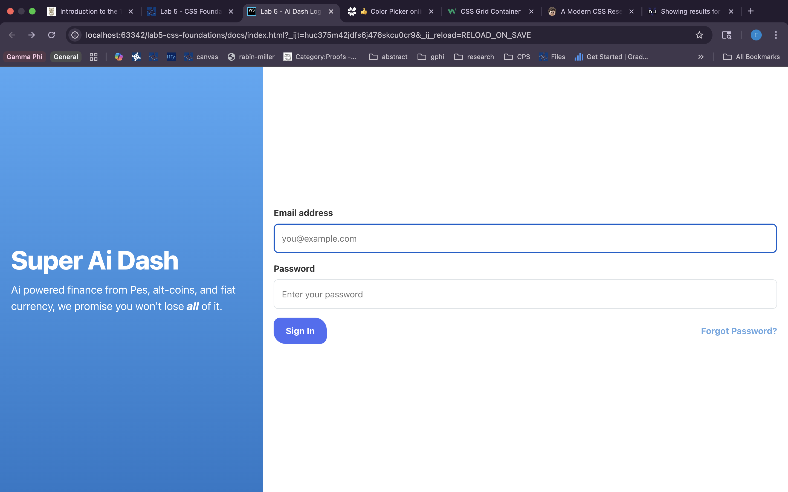
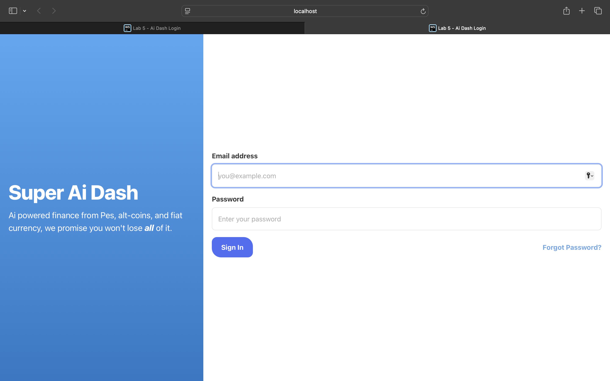
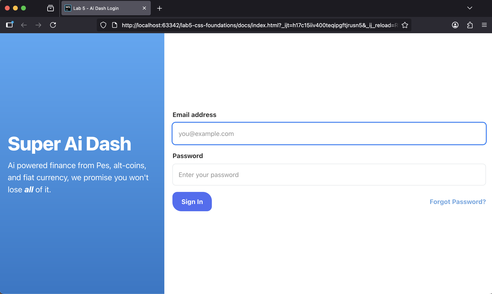

# Lab 5 – Ai Dash Login

A responsive, accessible two-column login page built with modern CSS and semantic HTML.

**Live site:**  https://eden-elise.github.io/lab5-css-foundations/  
**Repository:** https://github.com/eden-elise/lab5-css-foundations

---

## What I Built

- Two-column layout using **CSS Grid**
- Design tokens with **CSS variables** for color, spacing, radii, and typography
- **Hover & focus interactions**
  - Button hover color + smooth transitions
  - Inputs get a soft focus ring (border + box-shadow)
- **Cross-browser:** tested in Chrome, Safari, and Firefox

---

## Screenshots (three browsers)

**Chrome (macOS)**  


**Safari (macOS)**  


**Firefox (macOS)**  


**HTML validation (Nu HTML Checker)**  


---

## Implementation Notes

### Layout

The wrapper uses Grid:
```css
   .grid-container {
      display: grid;
      grid-template-columns: 1fr 2fr;
      min-height: 100vh;   /* Safari fallback */
      min-height: 100dvh;  /* Modern browsers */
      width: 100%;
    }
```
 
Each panel (`#login-info`, `#login-form`) uses Flexbox with `justify-content: center` for vertical centering.

### Design Tokens (CSS Variables)

Defined in `:root`:

- **Colors:** `--top-blue`, `--bottom-blue`, `--signin-blue`, text + border colors  
- **Spacing scale:** `--space-2 … --space-6`  
- **Radius:** `--radius-sm`  
- **Typography:** `--font-body`, `--font-hero`, weights (`--fw-regular`, `--fw-bold`, `--fw-extrabold`)  
- **Letter spacing:** `--ls-tight: -0.02em` to gently tighten big headings

### Interactions (Hover/Focus)

**Button**
```css
button {
      background: var(--signin-blue);
      color: var(--white-color);
      font-weight: var(--fw-bold);
      border: 0;
      border-radius: var(--radius-sm);
      padding: 0.75rem 1.375rem;
      transition: background-color 200ms ease, box-shadow 200ms ease, transform 80ms;
    }
    button:hover  { background: var(--bottom-blue); box-shadow: 0 8px 20px rgba(0,0,0,.08); }
    button:active { transform: translateY(1px); }
    button:focus-visible { outline: none; box-shadow: 0 0 0 3px rgba(77,168,245,.35); }
```
    
**Inputs**
```css
 input:focus {
      border-color: var(--top-blue);
      box-shadow: 0 0 0 3px rgba(77,168,245,.25);
      outline: none;
    }
```
## Challenges & Fixes

- **Safari not filling viewport height**  
  Some Safari versions ignore `100dvh`. Added a fallback and ensured stretching:
```css
.grid-container { 
  min-height: 100vh;   /* fallback for older Safari */
  min-height: 100dvh;  /* modern browsers */
}
```
- **Validator warning: “Section lacks heading”**  
  so I added a hidden heading instead of using a div tag:

```css
<h2 class="sr-only">Sign in</h2>
```

- **Custom elements (`<form-field>`, `<password-recovery>`)**  

---

## Deploy (GitHub Pages)

1. Push the repo to GitHub.  
2. **Settings → Pages** → Source: *Deploy from a branch* → Branch: `main` (or choose `/docs` folder).  
3. Save and wait for deployment to finish.  
4. Update the **Live site** link at the top of this README.
